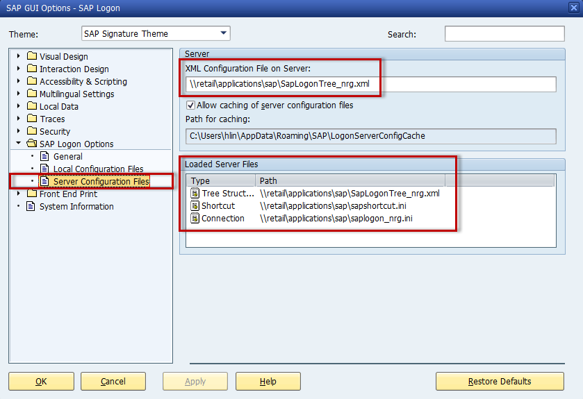

# Deploy #
Eclipse will be used to deploy CCUX application to the SAPUI5 ABAP repository.  

***
## Setting up Eclipse ##
Please make sure you have [UI5 toolkit](prerequisites.md#markdown-header-sap-ui-development-toolkit-for-html5) installed in your Eclipse.

### File content ##
In your Eclipse, go to `Window > Preferences > Team > File Content`

The content type for the following extensions need to be set to *Binary*. If the entry is not in your Eclipse, please add it in by pressing `Add Extension...`.

Extension  | Extension | Extension | Extension | Extension | Extension | Extension     | Extension | Extension
---------- | --------- | --------- | --------- | --------- | --------- | ------------- | --------- | ---------
\*.bmp     | \*.class  |  \*.css   | \*.cur    | \*.dll    | \*.doc    | \*.eot        | \*.exe    | \*.gif
\*.htm     | \*.html   |  \*.ico   | \*.jar    | \*.jpeg   | \*.jpg    | \*.js         | \*.json   | \*.less
\*.library | \*.md     |  \*.off   | \*.pdf    | \*.png    | \*.ppt    | \*.properties | \*.so     | \*.theme
\*.tif     | \*.tiff   |  \*.ttf   | \*.txt    | \*.woff   | \*.xls    | \*.xml        | \*.zip    |

### SAP Logon ###
Eclipse reads SAP logon information from your **SAP GUI Local Configuration Files**. If your SAP GUI is configured to read configuration files from the server only, please make a copy of the configuration files from the network and add them to your local machine as indicated below.

***
## Deploy CCUX application ##

***
## SAPUI5 ABAP repository ##
CCUX related modules are stored in package `ZCCUX_UI5`.

