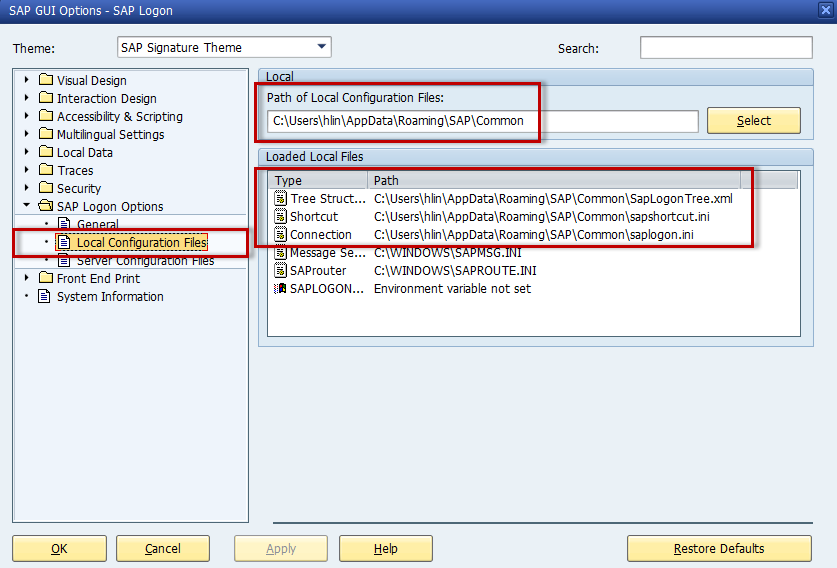

# Deploy #
Eclipse will be used to deploy the CCUX application to the SAPUI5 ABAP repository.

***
## Setting up Eclipse ##
Please make sure that you have [UI5 toolkit](prerequisites.md#markdown-header-sap-ui-development-toolkit-for-html5) installed in your Eclipse.

### File content ##
Setting relevant file content types to *Binary* prevents the [end of line marker](http://help.sap.com/saphelp_uiaddon10/helpdata/en/46/d0d54889be48d7abba0fa061c65835/content.htm) issue.

In your Eclipse, go to `Window > Preferences > Team > File Content`. The content type for the following extensions need to be set to *Binary*. If the entry is not in your Eclipse, please add it in by pressing `Add Extension...`.

Extension  | Extension | Extension | Extension | Extension | Extension | Extension     | Extension | Extension
---------- | --------- | --------- | --------- | --------- | --------- | ------------- | --------- | ---------
\*.bmp     | \*.class  |  \*.css   | \*.cur    | \*.dll    | \*.doc    | \*.eot        | \*.exe    | \*.gif
\*.htm     | \*.html   |  \*.ico   | \*.jar    | \*.jpeg   | \*.jpg    | \*.js         | \*.json   | \*.less
\*.library | \*.md     |  \*.off   | \*.pdf    | \*.png    | \*.ppt    | \*.properties | \*.so     | \*.theme
\*.tif     | \*.tiff   |  \*.ttf   | \*.txt    | \*.woff   | \*.xls    | \*.xml        | \*.zip    |

### SAP Logon ###
Eclipse reads SAP logon information from your **SAP GUI Local Configuration Files** only. If your SAP GUI is configured to read configuration files from the server only, please make a copy of the configuration files from the network and add them to your local machine as indicated below.




***
## Deploy CCUX application ##


***
## Grunt deploy tasks ##
Grunt deploy tasks are being used to copy the generated build folders from CCUX to the corresponding Eclipse projects. The tasks are divided into four main scenarios and are maintained at:

Scenario  | Maintained at
--------- | ---------------------------
Module    | `grunt\deploy\module.js`
Control   | `grunt\deploy\control.js`
Baseline  | `grunt\deploy\base.js`
Component | `grunt\deploy\component.js`

##

In order to invoke Grunt to deploy a scenario, open your command prompt and navigate to your local CCUX repository root folder where the `Gruntfile.js` resides. Depending on your scenario, type one of the following commands:

**Module**
```
#!batch
grunt --deploy=module --moduleName=<module name> --moduleFolder=<module folder> --eclipseProjectPath=<eclipse project path>
```

> where
>
> <module folder> is the baseline folder name such as ZEMOD_APP
> <module name> is the baseline ui5 namespace such as nrg.module.app
> <eclipse project path> is the project path of the Eclipse project such as C:\Users\thew\workspace\eclipse\ZEMOD_APP

**Control**
```
#!batch
grunt --deploy=control --controlFolder=<control folder> --controlName=<control name> --eclipseProjectPath=<eclipse project path>
```

> where
>
> <control folder> is the baseline folder name such as ZECTRL_MAIN
> <control name> is the baseline ui5 namespace such as ute.ui.main
> <eclipse project path> is the project path of the Eclipse project such as C:\Users\thew\workspace\eclipse\ZECTRL_MAIN

**Baseline**
```
#!batch
grunt --deploy=base --baseFolder=<base folder> --baseName=<base name> --eclipseProjectPath=<eclipse project path>
```

> where
>
> <base folder> is the baseline folder name such as ZEBASE
> <base name> is the baseline ui5 namespace such as nrg.base
> <eclipse project path> is the project path of the Eclipse project such as C:\Users\thew\workspace\eclipse\ZEBASE

##

Generally speaking, this is what the Grunt deploy tasks perform:

* Cleanup the Eclipse project.
* Copy the build folder to the corresponding Eclipse project.

***
## SAPUI5 ABAP repository ##
The entire CCUX application is stored under package `ZCCUX_UI5`.


