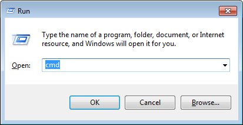

# Getting started #
Please make sure you went through the [Prerequisites](prerequisites.md) section first. This section assumes that you have necessary softwares installed in your local Windows machine.

***
## CCUX source codes ##
You will need to create a local CCUX Git repository in order to pull from the remote CCUX Git repository. You will begin by pressing `Windows logo + R` and type `cmd` to launch your command prompt.



Navigate within your command prompt to the folder where you would like to keep the CCUX source codes and type the following commands to create and navigate to the CCUX folder:

```
#!batch
mkdir CCUX
cd CCUX
```

While you are in the CCUX folder, type the following commands to create the local CCUX Git repository:

```
#!batch
git init
git config user.name <username>
git config user.email <email address>
```
> where
>
> `username` is your remote Git user name  
> `email address` is your remote Git email address  

Type the following commands to add the remote CCUX Git repository URL. You will have to use `https://` because NRG local network blocks the port for `git://`.

```
#!batch
git config url."https://".insteadOf git://
git remote add origin <CCUX remote repo>
```

> where
>
> `CCUX remote repo` is your remote CCUX Git repository `HTTPS` url


Finally, type the following command to download CCUX source code from the remote repository:

```
#!batch
git pull origin master
```

***
## Build module ##
In your command prompt, navigate to the CCUX folder that you have created through `mkdir CCUX` and type the following commands to install [Grunt command line interface globally](build.md/#markdown-header-overview) and all the modules that you need to build CCUX:

```
#!batch
npm install -g grunt-cli
npm install
```

***
## First build ##
In your command prompt, navigate to the CCUX folder that you have created through `mkdir CCUX` and type the following command to build CCUX:

```
#!batch
build
```
