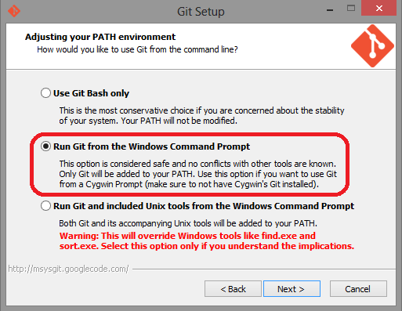

# Prerequisites
You will need to have at least [Git](#markdown-header-git) and [Node.js](#markdown-header-nodejs) installed on your local machine.

***
## Git
You will need Git in order to interact with the CCUX source code repository. You can get a copy of Git from the following link:

> [Git](https://git-scm.com/downloads)  

If you are installing Git from a Windows machine, please make sure that you are able to run Git from the command prompt.

If you think using the command prompt for Git is cumbersome, you can also install an additional standalone Git client such as [SourceTree](https://www.sourcetreeapp.com/) or Git plugin in your [editor of choice](#markdown-header-editor).

***
## Node.js
You will need to use Node.js to build your development. You can also use it as a web server to test your development locally. You can get a copy of Node.js from the following link:

> [Node.js](https://nodejs.org/download/)

***
## Editor
There is no restriction on the type of editor that you can use for your development but it would be wise to pick one that supports Javascript, CSS and XML. At the moment, we recommend the following editors due to their rich feature sets and popularities among web developers:

* [Atom](https://atom.io/)
* [Brackets](http://brackets.io/)
* [Sublime](http://www.sublimetext.com/)
* [SAP Web IDE](https://www.sapstore.com/solutions/60009/SAP-Web-IDE)

***
## SAP UI Development Toolkit for HTML5
You will need this if you want to deploy your changes to the SAPUI5 ABAP Repository. You can follow the instructions from the following link on how to setup the toolkit:

> [UI Development Toolkit for HTML5](https://tools.hana.ondemand.com/#sapui5)
